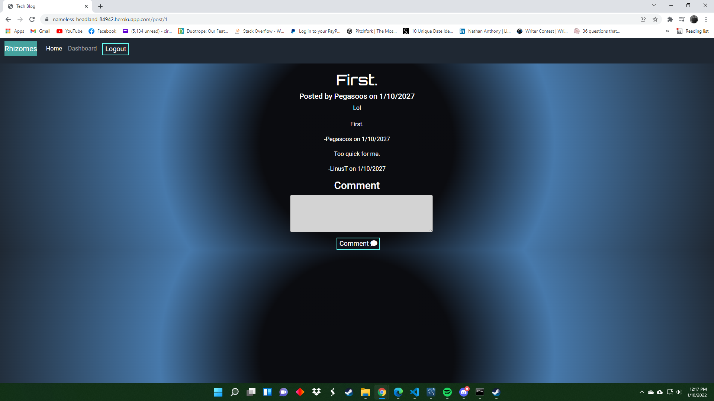
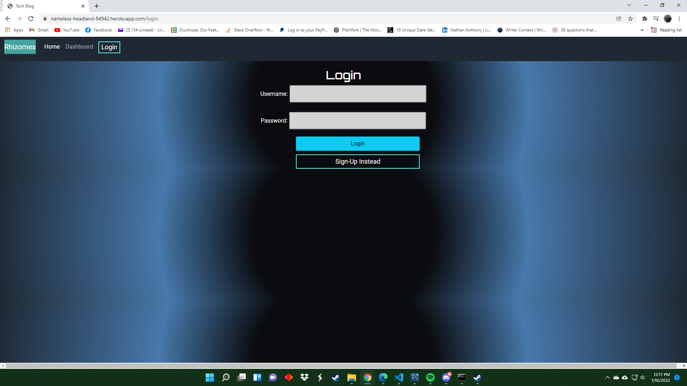

# Rhizomes Tech Blog

## Table of Contents
 1. [Description](#description)
 2. [Installation](#installation)
 3. [Usage](#usage)
 4. [Contributing](#contributing)
 5. [Tests](#tests)
 6. [License](#license)
 7. [Questions](#questions)

## Description
### Rhizomes is a blog website designed, like most blogs, for users to be able to sign-up, login, create posts, and view/comment on others posts.
## Installation
### No installation necessary. Just navigate to the url.
## Usage
### The website can be accessed from here: https://nameless-headland-84942.herokuapp.com/login
## Contributing
### 1. Fork the repository on GitHub. 2. Clone the project to your own machine. 3. Commit changes to your branch. 4. Push your work back up to your own fork. 5. Submit a pull request so we can review your changes.
## Tests
### None.
## License
### Distributed under the MIT_License
## Questions
### Email: definitelyisntme@gmail.com
### Github: [https://github.com/Pegasoos](https://github.com/Pegasoos)